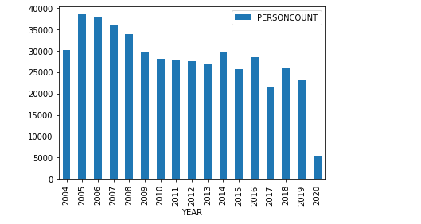
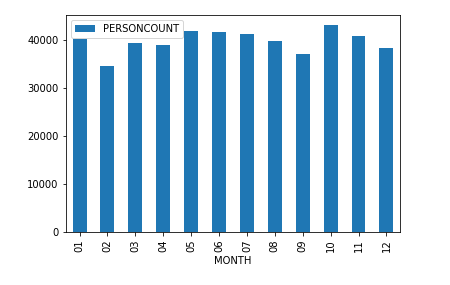
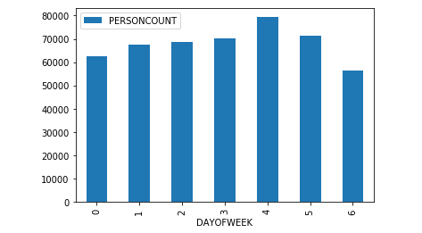

# Coursera_Capstone
Applied Data Science mainly used for the capstone project

## Introduction:
Road accidents are an unstoppable problem in our life and societies. Death on the road is a big puzzle in the current world. According to the World Health Organization(WHO), an estimated 1.35 million deaths worldwide were related to road traffic injuries in 2016 [1] .The death rate  has remained constant, compared to the world's population. Every 25 seconds, one person died in road accidents. In  2016, 34,436 motor vehicle crashes were recorded in the USA and 37,461 people died with an average of 102 per day [2].
In this work, I will try to find out the way to reduce the number of road accidents, by developing a machine learning model to predict the severity of accidents. When the road visibility and weather conditions are changing this model will alert the car user.

## Business Understanding:
The local government of Seattle is trying to implement some method to alert the car user, police , traffic system and health system about critical situations to reduce the death and injuries on the road.
The final capstone project in the IBM certificate course, we want to analyze the accident “severity” in terms of human fatality, traffic delay, property damage, or any other type of accident bad impact. The data was collected by Seattle SPOT Traffic Management Division and provided by Coursera via a link. This dataset is updated weekly and is from 2004 to present. It contains information such as severity code, address type, location, collision type, weather, road condition, speeding, among others.
The target audience of the project is local Seattle government, police, rescue groups, and last but not least, car insurance institutes. The model and its results are going to provide some advice for the target audience to make insightful decisions for reducing the number of accidents and injuries for the city.

## Data Understanding:
The dataset we select has 194,673 rows and 37 different independent variables.We will use SEVERITY CODE as your dependent variable Y, with different independent variables X to identify the cause of road accidents and level of severity.The dataset are quite large, we need to filter out the missing value and delete the unrelated columns. Then we select the independent variables such as address type, weather, road condition, and light condition to compare with Y which may have more impact on the accidents.The dependent variable, “SEVERITYCODE”, contains numbers that correspond to different levels of severity caused by an accident .
The code that corresponds to the severity of the collision:
- 3—fatality
- 2b—serious injury
- 2—injury
- 1—prop damage
- 0—unknown

Other important variables include:
- ADDRTYPE: Collision address type: Alley, Block, Intersection
- LOCATION: Description of the general location of the collision
- PERSONCOUNT: The total number of people involved in the collision helps identify severity involved
- PEDCOUNT: The number of pedestrians involved in the collision helps identify severity involved
- PEDCYLCOUNT: The number of bicycles involved in the collision helps identify severity involved
- VEHCOUNT: The number of vehicles involved in the collision identify severity involved
- INCDTTM : The date and time of the incident.
- JUNCTIONTYPE: Category of junction at which collision took place helps identify where most collisions occur
- WEATHER: A description of the weather conditions during the time of the collision
- ROADCOND: The condition of the road during the collision
- LIGHTCOND: The light conditions during the collision
- SPEEDING: Whether or not speeding was a factor in the collision (Y/N)
- SEGLANEKEY: A key for the lane segment in which the collision occurred
- CROSSWALKKEY: A key for the crosswalk at which the collision occurred
- HITPARKEDCAR: Whether or not the collision involved hitting a parked car

Furthermore, because of the existence of null values in some records, the data needs to be preprocessed before any further processing.

## Data Preparation:

The original data are not ready for our desired model. We have to prepare the data set to build a perfect model. We have to drop some non-relevant columns, which will not be useful to model. We will drop some null values as missing data  info. We update some missing/null value with the expected value. We replace the value with meaningful value. We will update date time as week of day. Time as a busy rush . Here we check the number of people affected by car accidents per year. We can told number of accident are decreasing but we can’t conclude it.

We also check the month to find out which have more incidents. January and October have more number of incidents compared to other months.

We also check the day of week. As we can see on graph drive on Friday there is more risk. Drivers should be more careful on this day. Here days are

- 0  #Monday
- 1  #Tuesday
- 2  #Wednesday
- 3  #Thursday
- 4  #Friday
- 5  #Saturday
- 6  #Sunday

## Modeling:    

I have used watson studio, Github as a repository and running Jupyter Notebook to preprocess data and build Machine Learning models. Regarding coding, I have used Python and some popular packages such as Pandas, NumPy and Sklearn.
Once I have load data into Pandas Dataframe, used ‘dtypes’ attribute to check the feature names and their data types. Then I have selected the most important features to predict the severity of accidents in Seattle. Among all the features, the following features have the most influence in the accuracy of the predictions:
“WEATHER”,
“ROADCOND”,
“LIGHTCOND”
As  mentioned earlier, “SEVERITYCODE” is the target variable.
I have run a value count on road (‘ROADCOND’) and weather condition (‘WEATHER’) to get ideas of the different road and weather conditions. I also have run a value count on light conditions (’LIGHTCOND’), to see the breakdowns of accidents occurring during the different light conditions.

### References:

1. GLOBAL STATUS REPORT ON ROAD SAFETY 2018.  World Health Organization. https://www.who.int/publications/i/item/global-status-report-on-road-safety-2018
2. NHTSA’s Quick Facts 2016 https://crashstats.nhtsa.dot.gov/Api/Public/ViewPublication/812451
